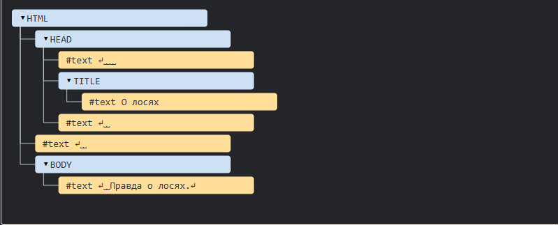

# DOM-дерево
## Основой HTML-документа являются теги
### В соответствии с объектной моделью документа («Document Object Model», коротко DOM), каждый HTML-тег является объектом. Вложенные теги являются «детьми» родительского элемента. Текст, который находится внутри тега, также является объектом.
### Все эти объекты доступны при помощи JavaScript, мы можем использовать их для изменения страницы.
### Например, document.body – объект для тега <body>.
### Если запустить этот код, то <body> станет красным на 3 секунды:
-1.png>)
## Это был лишь небольшой пример того, что может DOM. Скоро мы изучим много способов работать с DOM, но сначала нужно познакомиться с его структурой.
# Пример DOM
## Начнём с такого, простого, документа:
-1.png>)
## DOM – это представление HTML-документа в виде дерева тегов. Вот как оно выглядит:

## На рисунке выше узлы-элементы можно кликать, и их дети будут скрываться и раскрываться.
## Каждый узел этого дерева – это объект.
### Теги являются узлами-элементами (или просто элементами). Они образуют структуру дерева: <html> – это корневой узел, <head> и <body> его дочерние узлы и т.д.
### Текст внутри элементов образует текстовые узлы, обозначенные как #text. Текстовый узел содержит в себе только строку текста. У него не может быть потомков, т.е. он находится всегда на самом нижнем уровне.
### Например, в теге title есть текстовый узел "О лосях".
### Обратите внимание на специальные символы в текстовых узлах:
### перевод строки: ↵ (в JavaScript он обозначается как \n)
### пробел: ␣
### Пробелы и переводы строки – это полноправные символы, как буквы и цифры. Они образуют текстовые узлы и становятся частью дерева DOM. Так, в примере выше в теге head есть несколько пробелов перед title, которые образуют текстовый узел #text (он содержит в себе только перенос строки и несколько пробелов).
### Существует всего два исключения из этого правила:
## 1. По историческим причинам пробелы и перевод строки перед тегом head игнорируются
## 2. Если мы записываем что-либо после закрывающего тега body, браузер автоматически перемещает эту запись в конец body, поскольку спецификация HTML требует, чтобы всё содержимое было внутри body. Поэтому после закрывающего тега body не может быть никаких пробелов.
### В остальных случаях всё просто – если в документе есть пробелы (или любые другие символы), они становятся текстовыми узлами дерева DOM, и если мы их удалим, то в DOM их тоже не будет.
## Здесь пробельных текстовых узлов нет:
-1.png>)

# BOM (Browser Object Model)
### Объектная модель браузера (Browser Object Model, BOM) – это дополнительные объекты, предоставляемые браузером (окружением), чтобы работать со всем, кроме документа.
# Например
### Объект navigator даёт информацию о самом браузере и операционной системе. Среди множества его свойств самыми известными являются: navigator.userAgent – информация о текущем браузере, и navigator.platform – информация о платформе (может помочь в понимании того, в какой ОС открыт браузер – Windows/Linux/Mac и так далее).
### Объект location позволяет получить текущий URL и перенаправить браузер по новому адресу.
# Вот как мы можем использовать объект location:
-1.png>)
### Функции alert/confirm/prompt тоже являются частью BOM: они не относятся непосредственно к странице, но представляют собой методы объекта окна браузера для коммуникации с пользователем.
